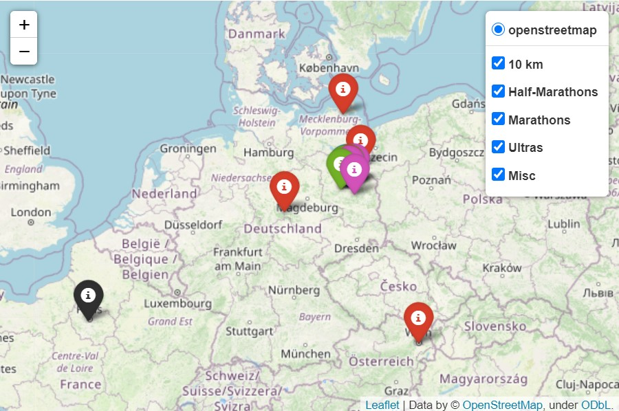

# Run Map
#### A map of all places where I took part in running events.

  

*Click picture to display full map*

The map is using the **Folium** python library. The base layer relies on **OpenStreetMap**.
https://python-visualization.github.io/folium/
https://www.openstreetmap.org/

All run events are loaded from a **CSV** file using read_csv() from the **Pandas** library. The CSV file contains all the pop-up informations, as well as event geographical coordinates (longitude, lattitude) used to place a marker on the map.
https://pandas.pydata.org/docs/reference/api/pandas.read_csv.html

When clicking on markers, a **pop-up** gives additonal information about the race (name, place, date, distance, time, event link, blog post, etc). The pop-up is using an **HTML template** from an external file and replaces its contents based on infos from the CSV file.

Events are color-coded based on the distance and a **legend** offers to blend them in and out.

#### Files description:
- **events.csv**: contains race events, location coordinates and all information displayed in the pop-up.
- **popup_contents.html**: contains the html template used to display the pop-ups. Fields contains in {} will be replaced by the corresponding information. Exemple: {link}
- **readme_preview.jpg**: image preview used in the readme
- **run_map.html**: HTML file generated by the Folium library
- **run_map.py**: Main script loading the contents of events.csv and popup_contents.html and generating run_map.html

Note: A new map (run_map.html) should be generated everytime the contents of the csv file or popup html template are modified.
